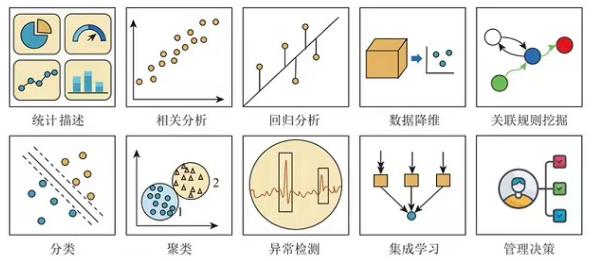
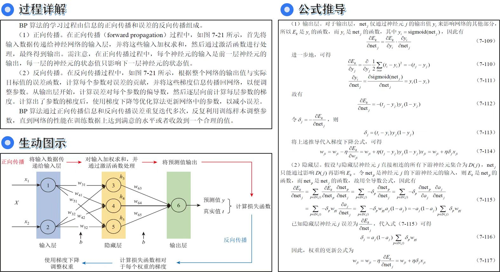

  > 本书内容涵盖统计描述、相关分析、回归分析、数据降维、关联规则挖掘、分类、聚类、异常检测和集成学习等数据挖掘9大核心领域。通过原理解析、数学推导、流程分析、计算示例和案例演示，精心设计231个图表、47个代码示例及5大类学习模块，遴选45个实践案例，全方位促进读者对内容的理解和掌握。此外，本书还配套丰富的数字化学习资源和全套教辅资料，形成了理论与实践并重的立体化教学体系。

# 核心特色

## 📖内容体系完备

本书的内容结构精心设计，涵盖了数据挖掘的各个关键领域。从基础概念到高级算法，从理论推导到实际应用，确保读者能够系统全面地掌握数据挖掘的核心知识。

## 📊算法原理透彻

在讲解每一个算法时，本书注重算法的原理剖析，力求以深入浅出的方式讲解复杂的数学推导与算法设计，使读者不仅知其然,更知其所以然。

## 📝实践案例丰富

理论与实践相结合是本书的一大特色。本书精心挑选45个实践案例，读者能够更好地理解如何将所学知识应用到真实的数据分析任务中，增强实际操作能力。

## ⚙️辅助元素多样

为了帮助读者更好地理解和掌握内容，本书配有大量图表、代码示例以及算法步骤、延伸阅读、注意事项、扩展说明、计算实例5种积木块，多样化的辅助元素使得学习过程更加直观和有趣。

## ✨知识总结全面

本书每一章的末尾均提供了知识总结清单帮助读者梳理。

## 🏆随书资源丰富

除了书中的内容，本书还提供了丰富的线上资源，包括数据集、代码集、课后习题，使读者能够更灵活地进行自学和拓展。

## 📨教辅资料齐全

本书为教师提供了完整的教辅资料，包括教学大纲、电子课件、习题解答等，可通过封底联系方式向出版社索取。

## 📜学习交流平台

本书在使用过程中积累了大量高质量反馈数据，包括读者记录的学习过程，对公式、算法的理解和解读，开展的编程实践，以及参阅的其他资料等，这些内容都以Markdown文档的形式发布在 https://github.com/XL-lab-bigdata/DataMining.git 上，以供读者广泛参考,提高学习效率。

# 相关资源

<!-- 第二行 -->

  

  <b></b> &nbsp;&nbsp;&nbsp;&nbsp;&nbsp;&nbsp;&nbsp;&nbsp;
  <b></b> &nbsp;&nbsp;&nbsp;&nbsp;&nbsp;&nbsp;&nbsp;&nbsp;
  <b></b>

<!-- 第三行 -->

  
  
  

  <b></b> &nbsp;&nbsp;&nbsp;&nbsp;&nbsp;&nbsp;&nbsp;&nbsp;
  <b></b> &nbsp;&nbsp;&nbsp;&nbsp;&nbsp;&nbsp;&nbsp;&nbsp;
  <b></b>

<!-- 第四行 -->

  
  
  

  <b></b> &nbsp;&nbsp;&nbsp;&nbsp;&nbsp;&nbsp;&nbsp;&nbsp;
  <b></b> &nbsp;&nbsp;&nbsp;&nbsp;&nbsp;&nbsp;&nbsp;&nbsp;
  <b></b>

# 购买链接

  

## 📑相关评价

# 注意事项

  > 1. 因部分数据集过大无法上传至 GitHub，我们已将其由 .csv 转换为 .parquet 格式，数据内容不变，并同步更新了相关代码。
  > 2. 本书所有代码均为“独立脚本(independent script)”，不做“可引入模块(importable module)”使用，脚本名与书籍章节编号保持一致。若需复用部分代码，请按 pep 8 要求自行更改文件名。
