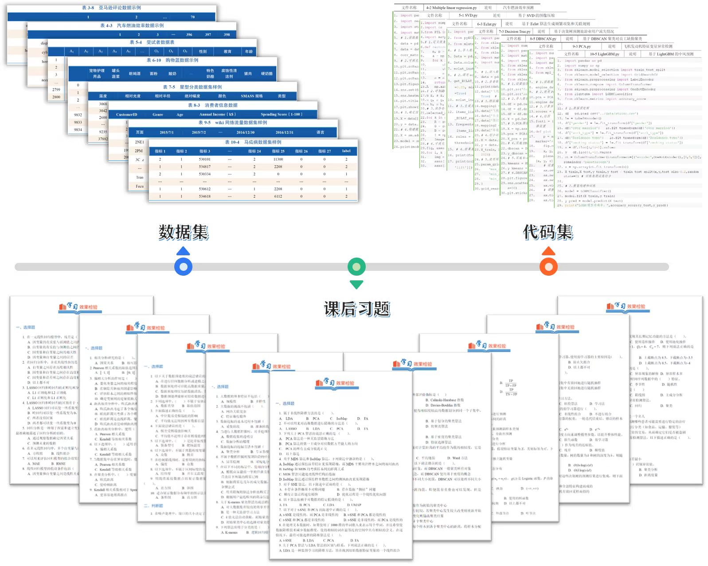
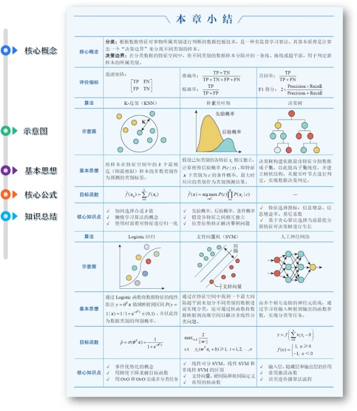
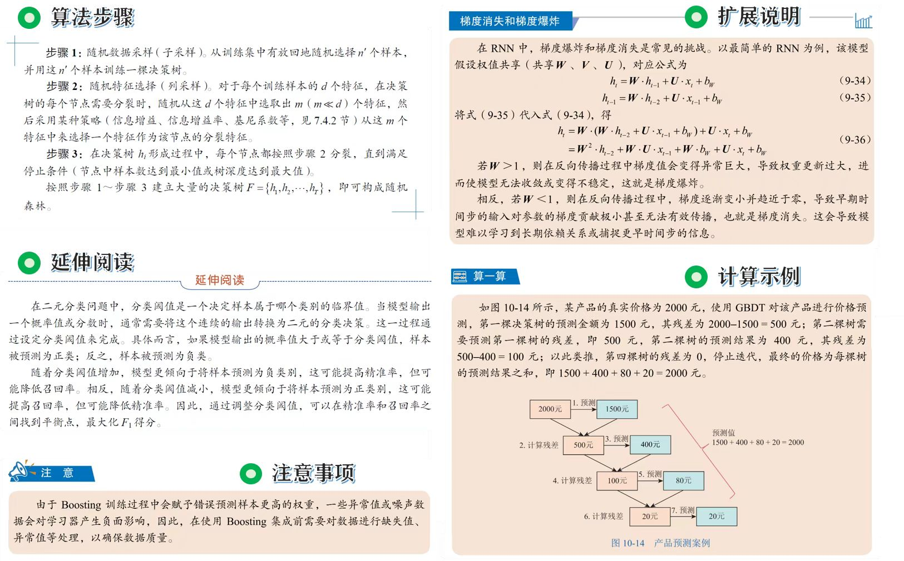
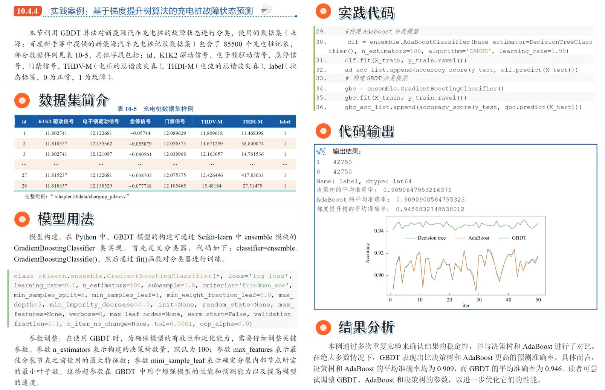
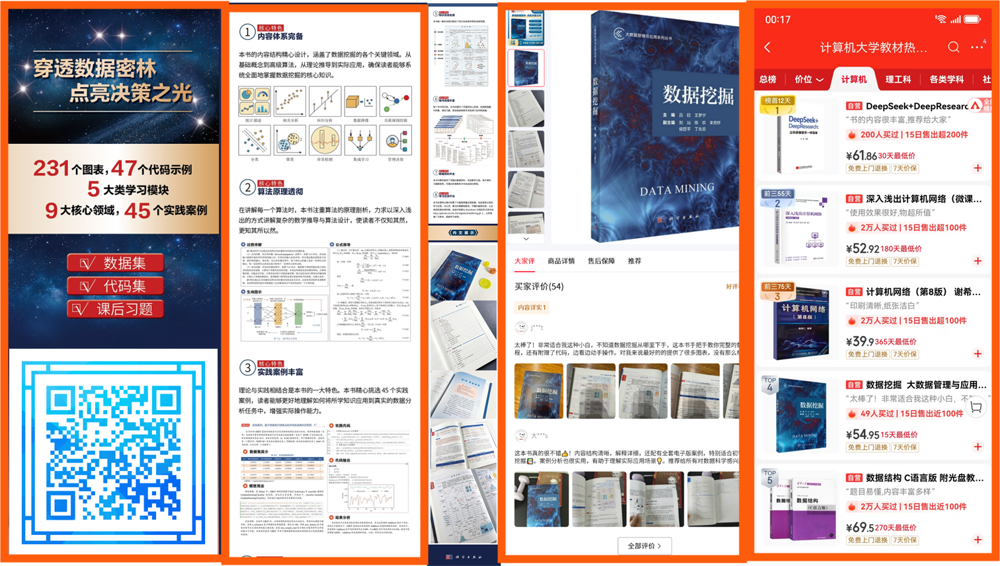

  > 流数据是指以连续不断的方式生成和传输的数据流，这些数据需要在生成的同时被处理和分析，以便及时获取洞察和采取行动。流数据广泛应用于实时监控、金融交易、社交媒体分析、物联网（IoT）设备数据采集等场景。流数据具有以下特点：
  >
  > ✔ 9大核心领域。
  > ✔ 45个实践案例。
  > ✔ 5大类学习模块。
  > ✔ 数字化学习资源。

# 精美配图

<!-- 第一行：二张图片 -->

  
  

  <b></b> &nbsp;&nbsp;&nbsp;&nbsp;&nbsp;&nbsp;&nbsp;&nbsp;
  <b></b> &nbsp;&nbsp;&nbsp;&nbsp;&nbsp;&nbsp;&nbsp;&nbsp;
  <b></b>

<!-- 第二行：二张图片 -->

  
  

  <b></b> &nbsp;&nbsp;&nbsp;&nbsp;&nbsp;&nbsp;&nbsp;&nbsp;
  <b></b> &nbsp;&nbsp;&nbsp;&nbsp;&nbsp;&nbsp;&nbsp;&nbsp;
  <b></b>

# 相关资源

<!-- 第二行 -->

  

  <b></b> &nbsp;&nbsp;&nbsp;&nbsp;&nbsp;&nbsp;&nbsp;&nbsp;
  <b></b> &nbsp;&nbsp;&nbsp;&nbsp;&nbsp;&nbsp;&nbsp;&nbsp;
  <b></b>

<!-- 第三行 -->

  
  
  

  <b></b> &nbsp;&nbsp;&nbsp;&nbsp;&nbsp;&nbsp;&nbsp;&nbsp;
  <b></b> &nbsp;&nbsp;&nbsp;&nbsp;&nbsp;&nbsp;&nbsp;&nbsp;
  <b></b>

<!-- 第四行 -->

  
  
  

  <b></b> &nbsp;&nbsp;&nbsp;&nbsp;&nbsp;&nbsp;&nbsp;&nbsp;
  <b></b> &nbsp;&nbsp;&nbsp;&nbsp;&nbsp;&nbsp;&nbsp;&nbsp;
  <b></b>

# 购买链接

<!-- 第一行 -->

  

  <b></b> &nbsp;&nbsp;&nbsp;&nbsp;&nbsp;&nbsp;&nbsp;&nbsp;
  <b></b> &nbsp;&nbsp;&nbsp;&nbsp;&nbsp;&nbsp;&nbsp;&nbsp;
  <b></b>

<!-- 第二行 -->

  

  <b></b> &nbsp;&nbsp;&nbsp;&nbsp;&nbsp;&nbsp;&nbsp;&nbsp;
  <b></b> &nbsp;&nbsp;&nbsp;&nbsp;&nbsp;&nbsp;&nbsp;&nbsp;
  <b></b>

# 注意事项

1. 因部分数据集过大无法上传至 GitHub，我们已将其由 .csv 转换为 .parquet 格式，数据内容不变，并同步更新了相关代码。
2. 本书所有代码均为“独立脚本(independent script)”，不做“可引入模块(importable module)”使用，脚本名与书籍章节编号保持一致。若需复用部分代码，请按 pep 8 要求自行更改文件名。
