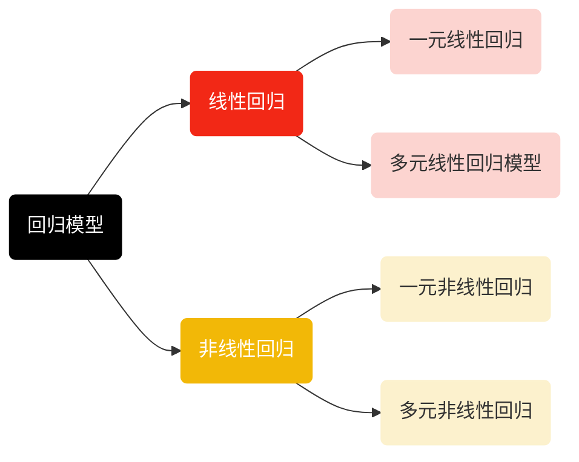

# 回归分析笔记

## 第一部分 回归分析概论

**1.定义：**回归分析是研究一个随机变量（$y$，也称因变量或被解释变量）关于另一个（$x$，也称自变量、解释变量）或一组变量$(x_{1},x_{2},\cdots,x_{p})$之间相互关系的统计分析方法，常用于时间序列分析、变量之间的因果发现以及预测估计等。

（1）**回归模型（Regression model)** ：是通过回归分析建立起来的数学模型$y=f(x)$，用于定量描述变量之间的相互关系，根据变量的数量，可以划分为一元回归和多元回归，根据函数关系的具体形式，它可以分为线性回归模型和非线性回归模型。



（2）**应用步骤**：

- 根据任务目的收集并处理变量数据，即样本观测值；
- 根据样本观察值分析变量之间相关关系的具体形式，并选定适合描述变量间关系的模型；
- 按照一定准则(如最小二乘法)估计模型中的未知参数，以求得回归模型具体方程；
- 对回归模型和参数估计值进行显著性检验以确定模型的效用
- 利用模型对因变量做出解释或者预测

**2.回归模型的评价指标**（用于评估回归模型的预测结果和实际观测值之间的差异）：

- **拟合优度检验：**检验样本数据点聚集在回归线周围的密集程度，常用统计量为$R^2$，$R^{2}=\frac{\mathrm{ESS}}{\mathrm{TSS}}=1-\frac{\mathrm{RSS}}{\mathrm{TSS}}=\frac{\sum_{i=1}^{N}(\hat{y}_{i}-\overline{y})^{2}}{\sum_{i=1}^{N}\left(y_{i}-\overline{y}\right)^{2}}$，$R^2\subset[0,1]$，判定系数$R^2$值就越高，越能有效反映回归方程的拟合效果。

其中总平方和（$TSS$）为所有点与样本均值离差的平方和，反映样本观测值总体离差的大小；回归平方和（$ESS$）反映的是模型中解释变量所解释的那部分离差的大小,即自变量$x$的变化对因变量$y$取值变化的影响；残差平方和($RSS$)反映样本观测值与估计值偏离的大小,即随机因素（除$x$以外的其他因素）对$y$取值的影响。

注：$R^2$只适用于线性回归模型，在带有截距项的线性最小二乘多元回归中，$R^2$等于实测值$y_i$和拟合值$\hat{y}_i$的相关系数的平方，即$R^{2}=\left(\frac{\sum_{i=1}^{n}\left(y_{i}-\overline{y}\right)\left(\hat{y}_{i}-\overline{\hat{y}}\right)}{\sqrt{\sum_{i=1}^{n}\left(y_{i}-\overline{y}\right)^{2}\sum_{i=1}^{n}\left(\hat{y}_{i}-\overline{\hat{y}}\right)^{2}}}\right)^{2}$，其中$\overline{y}$是实测值的均值，$\overline{\hat{y}}$是拟合值的均值

- **平均绝对误差（MAE）：**平均绝对误差（MAE）是绝对误差的平均值，即$\mathrm{MAE}=\frac{1}{N}\sum_{i=1}^{N}\left|\hat{y}_{i}-y_{i}\right|$，$\mathrm{MAE}\subset$$\left[0,+\infty\right)。$$\mathrm{MAE}$的值越趋近于0，表示模型的预测误差越小，即模型的预测结果与实际观测值越接近,拟合效果越好。
- **均方根误差（RMSE）：**均方根误差（RMSE）是预测值与实际观测值之间差值的平方的平均值的平方根，即$\mathrm{RMSE}=\sqrt{\frac{1}{N}\sum_{i=1}^{N}\left(\hat{y}_{i}-y_{i}\right)^{2}}$，RMSE 更加关注较大误差的影响，对异常值更敏感。
- **平均绝对百分比误差（MAPE）：**平均绝对百分比误差（MAPE）计算的是预测值与实际观测值之间的绝对百比差值的平均值，使用绝对值来避免正误差和负误差之间的相百抵消，即$MAPE=\frac{1}{N}\sum_{i=1}^{N}\left|\frac{\hat{y}_{i}-y_{i}}{y_{i}}\right|\times100\%$​，MAPE 可以直观地表示预测误差的百分比，使得不同规模的数据具有可比性，旦其对较小的实际观测值更敏感，可能会导致误差放大。

**注意：**以上指标均有其适用范围和局限性，==在实际运用过程中，常常需要考虑问题目标、数据特点、领域知识和经验，并综合多个指标进行评估==，以得到更全面准确的模型性能评估结果。

## 第二部分 线性回归

**1.概念：**因变量（$y$）和一个或多个自变量$(x/x_{1},x_{2},\cdots,x_{p})$之间为线性关系时的回归，通用回归模型表达式为：$y=\beta_{0}+\beta_{1}x_{1}+\beta_{2}x_{2}+\cdots+\beta_{p}x_{p}+\varepsilon$

（1）**一元线性回归**：是指只涉及一个自变量，且因变量$y$与自变量$x$之间呈线性关系的回归，回归模型表达式形如$y=\beta_{0}+\beta_{1}x+\varepsilon$，其中$\varepsilon$为随机误差，$\beta_0、\beta_1$为回归系数。

一元线性回归模型需要满足以下基本假设:

- 线性关系。观测数据相互独立且自变量和因变量之间存在线性关系。
- 正态性和齐方差性。误差$\varepsilon$服从$N(0,\sigma^{2})$分布，且在不同的自变量取值上，满足$E(\varepsilon)=0,D(\varepsilon)=\sigma^{2}$，即残差的方差恒定。
- 独立性。误差彼此之间不相关且误差和自变量不相关。

在上式中，被解释变量$y$的变化可以分为两部分:一部分是由解释变量$x$的变化引起的$y$的线性变化部分，即能通过模型中的变量来解释的部分，由$\beta_{0}+\beta_{1}x$表示；另一部分是由其他随机因素引起的变化部分，即不能由模型中变量来解释的部分,体现在模型的误差项$\varepsilon$中。

（2）**参数估计**：一元线性回归模型常用的估计方法为最小二乘法。

==最小二乘法的基本思想是通过最小化观测值与模型预测值之间的误差平方和，来估计模型参数。==假设我们有一组观测数据 $(x_i, y_i)$，并且我们认为 $y$ 和 $x$ 之间存在某种关系，例如线性关系$y=\beta_{0}+\beta_{1}x+\varepsilon$，我们希望找到参数 $\beta_{0}$ 和 $\beta_{1}$，使得模型在各个观测点上的误差平方和最小。

**估计方法：**设$\hat{\beta}_{0}$、$\hat{\beta}_{1}$是截距项$\beta_{0}$和回归系数$\beta_{1}$的最小二乘估计，则回归模型方程为：$\hat{y}=\hat{\beta}_{0}+\hat{\beta}_{1}x$，残差平方和RSS的计算公式为：$RSS=\sum_{i=1}^{N}\left(y_{i}-(\hat{\beta}_{0}+\hat{\beta}_{1}x_{i})\right)^{2}$

求得残差平方和后，对其求导并令导数等于零，即可求解回归模型参数的最优估计值。令$RSS$对$\hat{\beta}_{0}$和$\hat{\beta}_{1}$的一阶偏导数为0，有：$\frac{\partial RSS}{\partial\hat{\beta}_{0}}=-2\sum_{i=1}^{N}(y_{i}-\hat{\beta}_{0}-\hat{\beta}_{1}x_{i})=0$和$\frac{\partial RSS}{\partial\hat{\beta}_{1}}=-2\sum_{i=1}^{N}(y_{i}-\hat{\beta}_{0}-\hat{\beta}_{1}x_{i})x_{i}=0$，由此可得$\hat{\beta}_{0}=\overline{y}-\hat{\beta}_{1}\overline{x}$和$\hat{\beta}_{1}=\frac{\sum_{i=1}^{N}(x_{i}-\overline{x})(y_{i}-\overline{y})}{\sum_{i=1}^{N}(x_{i}-\overline{x})^{2}}$，假设$L_{xx}=\sum_{i=1}^{N}(x_{i}-\overline{x})^{2}=\sum_{i=1}^{N}x_{i}^{2}-\frac{1}{N}\left(\sum_{i=1}^{N}x_{i}\right)^{2}$，$L_{xy}=\sum_{i=1}^{N}(x_{i}-\overline{x})(y_{i}-\overline{y})=\sum_{i=1}^{N}x_{i}y_{i}-\frac{1}{N}\left(\sum_{i=1}^{N}x_{i}\right)\left(\sum_{i=1}^{N}y_{i}\right)$，$L_{yy}=\sum_{i=1}^{N}\left(y_{i}-\overline{y}\right)^{2}$，则$\hat{\beta}_{0}=\overline{y}-\hat{\beta}_{1}\overline{x}$，$\hat{\beta}_{1}=\frac{L_{xy}}{L_{xx}}$，回归方程式经过点$(\overline{x},\overline{y})$。

**代码示例**

在Python中，可以使用**Scipy.optimize**模块中的**Least_squares**函数来实现最小二乘法。具体操作代码如下：

```python
import numpy as np
from scipy.optimize import least_squares

# 定义残差函数
def fun(params, x, y):
a, b = params
return beta_{0} * x + b - y

# 观测数据
x_data = np.array([1, 2, 3, 4, 5])
y_data = np.array([2, 4, 6, 8, 10])

# 初始猜测值
initial_guess = np.array([1.0, 1.0])

# 使用least_squares函数进行拟合
result = least_squares(fun, initial_guess, args=(x_data, y_data))

# 输出拟合结果
print("拟合参数:", result.x)
```

从几何角度来看，最小二乘法的目标是找到一个使得误差平方和最小的参数组合。通过将观测数据投影到模型的参数空间中，我们可以找到一个最佳拟合的解。

（3）**统计检验**：除拟合优度检验外，一元线性回归模型常用F检验、t检验进行显著性检验，下表列出了不同检验方法构造的统计量和自由度。

|       | 原假设/备择假设  | 统计量                                                    | 自由度    | 拒绝域                                     |
| ----- | ---------------- | --------------------------------------------------------- | --------- | ------------------------------------------ |
| F检验 | $H_0：\beta_1=0$ | $F=\frac{ESS/1}{RSS/N-2}$                                 | $(1,N-2)$ | $F>F_{\alpha}\left(1,N-2\right)$           |
|       | $H_1：\beta_1≠0$ |                                                           |           |                                            |
| T检验 | $H_0：\beta_1=0$ | $t=\frac{\widehat{\beta}\sqrt{L_{xx}}}{\widehat{\sigma}}$ | $N-2$     | $\vert t\vert>t_{1-\frac{\alpha}{2}}(N-2)$ |
|       | $H_1：\beta_1≠0$ |                                                           |           |                                            |

注：F检验用于评估整体回归模型的显著性，检验解释量和被解释变量之间的线性关系是否显著。T检验用于评估每个自变量的回归系数是否显著不为零。

补充：假设检验是统计推断的基本问题之一，在进行假设检验时，首先要确定原假设$H_0$和备择假设$H_1$，然后判断两个假设的真伪，检验过程中可能会犯两类错误：==“弃真”错误和“取伪”错误。==

| 判断\|实际 | $H_0$为真 | $H_1$为真 |
| ---------- | --------- | --------- |
| 接受$H_0$  | 判断正确  | 取伪      |
| 拒绝$H_0$  | 弃真      | 判断正确  |

显著性检验是指在假设条件满足的情况下，将犯第I类错误的概率控制在显著性水平$\alpha$（$0<\alpha<1$）内，通常取$\alpha=0.05$，$\alpha=0.025$，$\alpha=0.01$三种情况。

（4）**实践案例：直播平台观众数预测**

背景：使用数据集（livestreaming.csv）进行线性回归分析，建立主播数量预测观众数量的回归模型。

步骤：（i）导入并读取数据集（livestreaming.csv）

```python
import pandas as pd  # 导入pandas库，用于数据处理
import statsmodels.api as sm  # 导入statsmodels库，用于统计模型
from matplotlib import pyplot as plt  # 导入matplotlib的pyplot模块，用于绘图

# 1. 读取数据集
data = pd.read_csv('../data/livestreaming.csv')  # 读取CSV文件中的数据
X = data['streamers_count']  # 获取主播数量数据
y = data['viewers_count']  # 获取观众数量数据
```

（ii）构建一元回归模型。在python中，可以使用statsmodels库中.add_constant方法和.OLS函数添加截距项并建立一元线性回归模型。其中，参数“data”表示要添加常数页的对象；参数“endog”和“exog”分别表示因变量和自变量。

```python
# 2. 构建一元线性回归模型
X = sm.add_constant(X)  # 添加截距项
model = sm.OLS(y, X).fit()  # 拟合模型
print(model.summary())  # 输出模型摘要信息
print("\n一元线性回归拟合模型结果图：")
```

运行结果：


（iii）绘制线性拟合图。使用 python 中的 plt.plot()函数绘制散点图以及拟合直线，以展示模型效果。具体代码如下:

```python
# 3. 绘制一元线性回归拟合图
plt.rcParams['font.sans-serif'] = ['STSong']  # 设置字体为宋体
plt.rcParams['axes.unicode_minus'] = False  # 解决负号显示问题
plt.rcParams.update({'font.size': 15})  # 设置字体大小
plt.figure(figsize=(5, 3))  # 设置图形大小
plt.plot(X['streamers_count'], y, 'c.')  # 绘制散点图，X['streamers_count']包括截距项
plt.plot(X['streamers_count'], model.predict(X), 'salmon')  # 绘制回归线
plt.xlabel('主播数量')  # 设置X轴标签
plt.ylabel('观众数量')  # 设置Y轴标签
plt.show()  # 显示图形
```

输出展示：

**结果解读：**一元线性回归模型为$y=2.448\times10^{7}+9221.6550x$。其余检验结果如下:
(i）回归系数的$t$检验结果为$p=0.000<0.05$，拒绝原假设，认为回归系数显著不为0。这意味着回归系数具有统计显著性和实际应用意义。
(ii）回归方程的$R^2 =0.896$，说明自变量 streamers_ count 能够解释因变量viewers_count的89.6%的变异程度，拟合效果较好。
(iii）回归方程F检验结果为$p=1.41e-130<0.05$，拒绝原假设，认为回归方程整体显著。这意味着回归模型中的主播数量与观众数量之间存在显著的线性关系。

**2.多元线性回归：**指有多个解释变量的线性回归模型，用于揭示$y$与多个解释变量$(x_{1},x_{2},\cdots,x_{p})$之间的线性关系，一般形式为：$y=\beta_{0}+\beta_{1}x_{1}+\beta_{2}x_{2}+\cdots+\beta_{p}x_{p}+\varepsilon$，其中$\beta_{0}$是回归常数，$\beta_1,\beta_2,\cdots,\beta_p$是回归系数，在该多元线性回归模型中，变量$y$的变化可由两个部分解释，一部分是由p个解释变量$x_{1},x_{2},\cdots,x_{p}$的变化引起的y的线性变化，即$\beta_{1}x_{1}+\beta_{2}x_{2}+\cdots+\beta_{p}x_{p}$，另一部分是由其它随机因素引起的$y$的变化，即$\varepsilon$。

（1）**参数估计**：多元线性回归模型中回归系数的估计与一元线性回归类似，具体如下：对于总体$(X_1,X_2,\cdots,X_p;Y)$的N组观测值$(x_{i1},x_{i2},\cdots,x_{ip};y_{i})$，其中，$i=1,2,\cdots,N,\quad N>p$，满足：$\begin{aligned}&y_{1}=\beta_{0}+\beta_{1}x_{11}+\beta_{2}x_{12}+\cdots+\beta_{p}x_{1p}+\varepsilon_{1}\\&y_{2}=\beta_{0}+\beta_{1}x_{21}+\beta_{2}x_{22}+\cdots+\beta_{p}x_{2p}+\varepsilon_{2}\\&y_{N}=\beta_{0}+\beta_{1}x_{N1}+\beta_{2}x_{N2}+\cdots+\beta_{p}x_{Np}+\varepsilon_{N}\end{aligned}$

用矩阵的形式可以表示为$Y=X\beta+\varepsilon$，其中

$\boldsymbol{Y}=\begin{pmatrix}y_{1}\\y_{2}\\\vdots\\y_{N}\end{pmatrix},\boldsymbol{X}=\begin{pmatrix}1&x_{11}&x_{12}&\cdots&x_{1p}\\1&x_{21}&x_{22}&\cdots&x_{2p}\\\vdots&\vdots&\vdots&\cdots&\vdots\\1&x_{N1}&x_{N2}&\cdots&x_{Np}\end{pmatrix},\boldsymbol{\beta}=\begin{pmatrix}\beta_{0}\\\beta_{1}\\\vdots\\\beta_{p}\end{pmatrix},\boldsymbol{\varepsilon}=\begin{pmatrix}\varepsilon_{1}\\\varepsilon_{2}\\\vdots\\\varepsilon_{N}\end{pmatrix}$

其中，$Y$称为观测向量，$X$称为设计矩阵;$\beta$称为待估计向量，$\varepsilon$是不可观测的n维随机向量，其分量相互独立。建立模型后使用最小二乘法来估计回归参数。设$\hat{\beta}_0,\hat{\beta}_1,\hat{\beta}_2,\cdots,\hat{\beta}_p$分别为参数$\beta_0,\beta_1,\beta_2,\cdots,\beta_p$的最小二乘估计，则回归方程为：$\hat{y}=\hat{\beta}_{0}+\hat{\beta}_{1}x_{1}+\hat{\beta}_{2}x_{2}+\cdots+\hat{\beta}_{p}x_{p}$

由最小二乘法原理可知，$\hat{\beta}_0,\hat{\beta}_1,\hat{\beta}_2,\cdots,\hat{\beta}_p$应使得全部观察值$y_{i}$，与回归值$\hat{y}$的残差平方和达到最小，即：

$\min(\mathrm{RSS})=\min\sum_{i=1}^{N}\left(y_{i}-\hat{\beta}_{0}-\hat{\beta}_{1}x_{i1}-\cdots-\hat{\beta}_{p}x_{ip}\right)^{2}$

令RSS 关于待估计参数$\hat{\beta}_0,\hat{\beta}_1,\hat{\beta}_2,\cdots,\hat{\beta}_p$的偏导数为0：

$\frac{\partial RSS}{\partial\hat{\beta}_{0}}=-2\sum_{i=1}^{N}(y_{i}-\hat{\beta}_{0}-\hat{\beta}_{i}x_{i1}-\cdots-\hat{\beta}_{p}x_{ip})=0$

$\frac{\partial RSS}{\partial\hat{\beta}_{j}}=-2\sum_{i=1}^{N}(y_{i}-\hat{\beta}_{0}-\hat{\beta}_{1}x_{i1}-\cdots-\hat{\beta}_{p}x_{ip})x_{ij}=0,j=1,2,\cdots,P$

由于$\left.X^{\mathrm{T}}\mathbf{Y}=\left(\begin{array}{cccc}1 & 1 & \cdots & 1\\ x_{11} & x_{21} & \cdots & x_{N1}\\ \vdots & \vdots &  & \vdots\\ x_{1p} & x_{2p} & \cdots & x_{Np}\end{array}\right.\right)\begin{pmatrix}y_1\\ y_2\\ \vdots\\ y_{N}\end{pmatrix}=\begin{pmatrix}\sum_{i=1}^{N}y_{i}\\ \sum_{i=1}^{N}x_{i1}y_{i}\\ \vdots\\ \sum_{i=1}^{N}x_{ip}y_{i}\end{pmatrix}$，所以$X^{\mathrm{T}}X\hat{\boldsymbol{\beta}}=X^{\mathrm{T}}Y$，$\left.\hat{\boldsymbol{\beta}}=\left(\begin{array}{c}{\hat{\beta}_{0}}\\{\hat{\beta}_{1}}\\{\vdots}\\{\hat{\beta}_{p}}\end{array}\right.\right)=\left(X^{\mathrm{T}}X\right)^{-1}X^{\mathrm{T}}Y$

（2）**统计检验**：多元线性回归模型的统诫检验包括拟合优度检验、回归系数的显著性检验等。

（i）==拟合优度检验==：多元线性回归模型的拟合优度检验也可以使用判定系数$R^2$。$R^2$越接近于1，回归模型的拟合效果越好。

然而，在多元线性回归中，增加方程中解释变量的个数（无论这些解释变量是否真正与被解释变量相关）会引起判定系数$R^2$的增加，进而导致过度拟合的问题，即模型在样本内表现良好但在样本外效果较差。因此，为解决此问题，需要考虑模型的自由度对$R^2$进行修正，使用调整的判定系数进行检验：$\overline{R}^{2}=1-\frac{\mathrm{RSS}/(N-p-1)}{\mathrm{TSS}/(N-1)}$。

==调整的判定系数也称复判定系数，$\overline{R}^{2}\subset[0,1]$，值越大表示模型的拟合优度越好。其中，$N$为样本量，$p$为自变量的个数。$N-p-1$为残差平方和的白由度，$N-1$为总离差平方和的自由度。==

补充：自由度在统计学中用于衡量数据集中取值不受限制的变量个数。在线性回归中，自由度的总数等于样本数量减去模型中的参数个数，其中，模型中的参数个数等于解释变量的个数加上常数项（截距）的个数。在一元线性回归中，若模型中有一个解释变量和一个截距，则自由度为$N-2$；在多元线性回归中，若有p个解释变量和一个截距，则自由度为$N-p-1$。

（ii）==回归系数的显著性检验==：（a）F检验法：在多元线性回归中，F检验用于检验回归模型的整体显著性。其原假设为自变量对因变量的联合影响不显著，即所有自变量的系数都等于零，$H_{0}{:}\beta_{1}=\beta_{2}=\cdots=\beta_{p}=0,\quad H_{1}{:}\exists\beta_{p}\neq0$

当$H_{0}$成立时，$y \sim N(\boldsymbol{\beta}_0,\sigma^2)$。此外，ESS与 RSS相互独立且满足：$\frac{\mathrm{ESS}}{\sigma^2}\sim\chi^2(p)，\frac{\mathrm{RSS}}{\sigma^2}\sim\chi^2(N-p-1)$，因此有$F=\frac{\mathrm{ESS}/p}{\mathrm{RSS}/(N-p-1)}\sim F(p,N-p-1)$

根据样本求出F统计量的数值后，对于给定的显著性水平$\alpha$，若$F>F_{\alpha}(p,N-p-1)$，则拒绝原假设，认为模型的线性关系在$\alpha$的显著性水平下成立。相反，如果接受$H_{0}$，则表明回归模型中的自变量整体上对因变量的解释能力不显著。

（b）t检验：t检验用于对回归方程中每个白变量的显著性进行逐个格验，对第$j$个回归系数进行显者验的原假设和备择假设分别为：$H_{0}{:}\beta_{j}=0,\quad H_{1}{:}\beta_{j}\neq0,\quad j=1,2,\cdots p$

定义统计量：$t_{j}=\frac{\hat{\beta}_{j}-\beta_{j}}{\sqrt{c_{jj}}\sigma}/\sqrt{\frac{\mathrm{RSS}/\sigma^{2}}{N-p-1}},\quad j=1,2,\cdots p$，其中$\hat{\beta}_{j}$是回归系数$\beta_{j}$的估计值：$c_{jj}$为矩阵$(X^TX)^{-1}$对角线上的第$j+1$个元素;$N-p-1$为自由度。

当$H_{0}$成立时，统计量$t_{j}$,服从自由度为$N-p-1$的$t$分布：$t_{j}=\frac{\hat{\beta}_{j}}{\sqrt{c_{jj}}\hat{\sigma}}\sim t(N-p-1)$，其中$\hat{\sigma}是\sigma$的无偏估计。给定显著性水平$\alpha$，若$\left|t_{j}\right|>t_{\alpha/2}\left(N-p-1\right)$，则拒绝原假设$H_{0}$，认为该自变量的系数是显著不为零的。

补充：==在建立多元回归模型时,由于遗漏重要自变量会引入偏差，因此常将与因变量相关的所有自变量都引入方程。==然而，部分自变量的引入对拟合优度没有明显影响，甚至可能降低回归方程的性能。因此，==为建立更优、更合适的回归模型,常采用向前选择、向后剔除、逐步回归的方法来纳入重要的自变量或剔除不必要的自变量。==

（a）**向前选择：**向前选择是将变量逐步纳入回归方程的过程，在引入的过程中将不显著变量剔除。

操作步骤：①计算各个变量对因变量$y$的影响显著程度（线性相关系数）并排序。②按照该排序，从大到小依次将自变量逐个引入方程并进行$t$检验。一旦在引入新变量后发现其对$y$的影响作用不显著，则将其剔除。③反复进行这个过程，直至既无显著变量引入回归方程，也无不显著变量从回归方程中剔除为止。

（b）向后剔除：向后剔除是是逐步剔除自变量的过程，适用于自变量少或无显著性自变量的情况。

操作步骤：①建立包含全部自变量的回归方程并进行$t$检验。②按照既定的显著性水平$α$，筛选出无显著性的变量，并剔除其中$t$检验值最小的自变量。③剔除该自变量后，重新进行$t$检验，并重复上述过程直至没有自变量需要剔除为止。

(c）逐步回归：逐步回归在向前选择策略的基础上结合向后剔除策略实现对自变量的选择。①实现向前选择的各项步骤将变量引入方程。②二次判断是否存在应该剔除出方程的变量，进行向后剔除。

**（3）实践案例：基于多元线性回归的汽车燃油效率预测**

背景：Auto MPG 数据集收集了不同型号汽车的基本特征信息以及对应的燃油效率数据（以每加仑英里数表示)，共398条数据样本。为了更好地理解不同因素对汽车燃油效率的影响，并建立预测模型，本例选择其中8列数据进行多元线性回归分析。

操作步骤：（1）数据准备与处理。导入数据并使用.dropna()函数处理缺失值。

```python
import pandas as pd
import seaborn as sns
import statsmodels.api as sm
import matplotlib.pyplot as plt
# 1.读取数据集
data = pd.read_csv('../data/auto_mpg.csv')  # 读取数据集
data = data.dropna()  # 缺失值处理
corr_matrix = data.corr()  # 计算相关系数矩阵
```

（2）相关性分析。使用seaborn库中的.heatmap函数绘制热力图展示各变量间的相关程度。

```python
# 2.可视化相关系数矩阵
plt.rcParams['font.sans-serif'] = ['STSong']  # 设置显示中文
plt.rcParams['axes.unicode_minus'] = False
plt.rcParams.update({'font.size': 20})
plt.figure(figsize=(12, 10))
sns.set(font='STSong', font_scale=2)
sns.heatmap(corr_matrix, annot=True, cmap='coolwarm')
plt.title('皮尔逊相关系数矩阵热力图', pad=20)
plt.show()
```

输出展示：

由图可知，燃油效率与发动机排量、引擎气缸数、发动机马力、汽车重量之间的相关性较强。

（3)建立模型。使用向后剔除方法建立多元线性回归模型。

输出结果：


**结果解读**：最终建立的多元线性回归模型为$y=-16.6939+0.0114x_{1}-0.0219x_{3}-0.0063x_{4}+0.7484x_{6}+1.3853x_{7}$，其余检验结果为：

（1）该模型的$R^{2}=0.82$，说明自变量能够解释因变量82%的变异程度。

(2）回归系数的t检验结果p值分别为$0.041、0.043、0.000、0.000$和$ 0.000$，均小于设定的显著性水平$0.05$，拒绝原假设，回归系数显著不为$0$，即自变量对因变量的影响均显著。
(3）模型的F检验结果为$p=2.73\times10^{-141}<0.05$，拒绝原假设，认为自变量与因变量间存在显著的线性关系。

## 第三部分 多重共线性

**1.概念：**当样本量大于回归系数个数时，如果矩阵$X$的列向量之间线性相关，则称自变量$x_1,x_2,\cdots,x_p$之间存在多重共线性。对于自变量$x_1,x_2,\cdots,x_p$，如果存在不全为$0$的常数，使得$c_0+c_1x_1+c_2x_2+\cdots+c_px_p=0$，则称自变量间存在完全多重共线性；如果存在不全为0的常数，使得$c_0+c_1x_1+c_2x_2+\cdots+c_px_p+v=0$，则称自变量$x_1,x_2,\cdots,x_p$之间存在不完全多重共线性。

**2.诊断方法：**（1）判定系数法：①计算各判定系数。将$x_{j}$作为因变量，剩余的$x_{1},x_{2},\cdots,x_{j-1},x_{j+1},\cdots,x_{p}$作为自变量进行线性回归，计算判定系数$R_j^2$（自变量$x_{j}$的判定系数)。若某次回归的判定系数较大，则表明在该次回归中作为因变量的$x_{j}$，可以用其他剩余解释变量的线性组合代替，即$x_{j}$与其他剩余解释变量间存在多重共线性。

②对回归方程进行检验。在求得各判定系数后，可进一步对出现较大判定系数的回归方程作$F$检验，构造$F$统计量：$F_{j}=\frac{R_{j}^{2}/(k-2)}{(1-R_{j}^{2})/(N-k+1)}\sim F(k-2,N-k+1)$

若存在较强的多重共线性，则$R_j^2$较大且接近于1，从而$F_{j}$值较大，因此，对于给定的显著性水平$\alpha$，若$F_{j}>F_{\alpha}\left(k-2,N-k+1\right)$，则可以判断存在多重共线性。
（2）方差膨胀因子：VIF量化了每个自变量受到其他自变量影响的程度，计算公式为：$\mathrm{VIF}_{j}=\frac{1}{1-R_{j}^{2}}\geq1,\quad j=1,2,\cdots,p$，当$\mathrm{VIF}_j\geq10$时，自变量$x_{j}$与其余自变量之间有严重的多重共线性，且这种多重共线性可能会严重影响最小二乘估计值。

**3.解决方案：**（1）剔除引起多重共线性的变量：此为应对多重共线性的常用方法，核心思想是将一个或多个相关的自变量从模型中剔除。具体可以采用向前选择、向后剔除和逐步回归方法。
（2）减小参数估计值的方差：多重共线性的存在会增加参数估计值的方差。为降低参数估计值的方差，可采用增大样本容量、岭回归等方法，以减少多重共线性带来的不利影响。岭回归在4.4小节有相关介绍,此处主要介绍增大样本容量的方法。
以只有两个自变量$x_1,x_2$的回归为例，假定因变量$y$与自变量$x_1,x_2$都已经中心化，则回归常数项为0，回归方程为$\hat{y}=\hat{\beta}_{1}x_{1}+\hat{\beta}_{2}x_{2}$，记$L_{11}=\sum_{i=1}^{n}x_{1}^{2},\quad L_{12}=\sum_{i=1}^{n}x_{1}x_{2},\quad L_{22}=\sum_{i=1}^{n}x_{2}^{2}$，则$x_1$与$x_2$之间的相关系数为：$r_{12}=\frac{L_{12}}{\sqrt{L_{11}L_{22}}}$，$\hat{\boldsymbol{\beta}}=(\hat{\beta}_1,\hat{\beta}_2)^T$的协方差矩阵为：$Co\nu(\hat{\boldsymbol{\beta}})=\sigma^2(X^TX)^{-1}$，$X^TX=\begin{pmatrix}L_{11}&L_{12}\\L_{12}&L_{22}\end{pmatrix}$，

由此可得$D(\hat{\beta}_{1})=\frac{\sigma^{2}}{(1-r_{12}^{2})L_{11}}$，$D(\hat{\beta}_{2})=\frac{\sigma^{2}}{(1-r_{12}^{2})L_{22}}$，在$r_{12}$固定不变的情况下，随着样本容量N的增大$L_{11}$和$L_{12}$均会增大，方差$D(\hat{\beta}_{1})$和$D(\hat{\beta}_{2})$均会减小，从而降低多重共线性的影响。

## 第四部分 岭回归

**1.概念：**岭回归是加入了$L2$正则项（岭惩罚项）的最小二乘回归方法。其目标是最小化残差平方和与正则化项之和，以有偏估计为代价来提高估计量的稳定性,消除多重共线性。目标函数为:$\min_{\beta}\left\|Y-X\hat{\beta}\right\|_{2}^{2}+\lambda\left\|\hat{\beta}\right\|_{2}^{2}$。其中第一项残差平方和用于拟合数据，第二项$L2$正则项用于限制回归系数的大小，使其趋向于稳定和收敛，$\hat{\beta}$为岭回归系数估计值，$\lambda$为控制正则项权重的岭参数。

推导过程：$V=\min_{\beta}\left\|Y-X\hat{\beta}\right\|_{2}^{2}+\lambda\left\|\hat{\beta}\right\|_{2}^{2}$$=\left(Y-X\hat{\beta}\right)^{T}\left(Y-X\hat{\beta}\right)+\lambda\hat{\beta}^{T}\hat{\beta}$$=Y^{\mathrm{T}}Y-Y^{\mathrm{T}}X\hat{\beta}-\hat{\beta}^{\mathrm{T}}X^{\mathrm{T}}Y+\hat{\beta}^{\mathrm{T}}X^{\mathrm{T}}X\hat{\beta}+\lambda\hat{\beta}^{\mathrm{T}}\hat{\beta}$

令$\frac{\partial V}{\partial\hat{\beta}}=0$，由$\frac{\partial V}{\partial\hat{\boldsymbol{\beta}}}=-X^{\mathrm{T}}Y-X^{\mathrm{T}}Y+2X^{\mathrm{T}}X\hat{\boldsymbol{\beta}}+2\lambda\hat{\boldsymbol{\beta}}$$=2\left(X^{\mathrm{T}}X+\lambda I\right)\hat{\beta}-2X^{\mathrm{T}}Y=0$可以得到最优解$\hat{\boldsymbol{\beta}}(\lambda)=(X^{\mathrm{T}}X+\lambda I)^{-1}X^{\mathrm{T}}Y$

**2.参数选择：**（1）岭迹法：岭迹是随着岭参数入的变化而发生的系数变化的轨迹。==通过绘制不同岭参数下岭回归模型的系数变化岭迹图，可以根据曲线的形状和趋势来确定适当的$\lambda$值和选取自变量。==当岭亦曲线稳定时，可以得到目标$\lambda$值。

（2）交叉验证：交叉验证是一种常用的模型选择和超参数调优方法。==在$k$折交叉验证中，数据集将被划分为$k$个大小相似的互斥子集(即折叠)，然后执行k次模型训练和评估==，在每次训练中，使用不同的折叠作为验证集，其余折叠作为训练集。最终将k次训练得到的模型的性能评估指标取平均值作为最终的评估结果。
操作步骤：（a）将数据集划分为$k$个折叠；（b）对每个候选的岭参数$\lambda$，重复以下操作：选择其中的一折作为验证集，其余折作为训练集；在训练集上拟合岭回归模型；使用验证集评估岭回归模型的性能，例如$R^2$；（c）选择具有最小评价指标值的岭参数$\lambda$，作为最终的岭参数。

**3.实践案例：基于岭回归的汽车燃油效率预测**

操作步骤：（1）数据准备和数据预处理。将燃油效率作为因变量，自变量为剩余所有变量。然后使用 sklearn中的 train_test_split 函数划分训练集和测试集。具体的，将自变量和因变量传入train_test_split 函数并设置test_size为0.3，random_state为1。函数将按照7:3的比例将数据划分成训练集和测试集，并保证随机数生成具有可复现性(每次运行结果一致)。最后再使用Z分数对数据进行标准化处理，使得不同特征之间的数值范围一致。

```python
# 1.读取数据集、数据预处理
data = pd.read_csv(r"C:\Users\33992\Desktop\chapter4\data\auto_mpg.csv", sep=',')
data = data.dropna()  # 缺失值处理
X = data[['displacement', 'cylinders', 'horsepower', 'weight', 'acceleration', 'model_year', 'origin']]
y = data.iloc[:, 7]
X_train, X_test, y_train, y_test = train_test_split(X, y, test_size=0.3, random_state=1)  # 将数据集分为训练集和测试集
X_train_scaled = (X_train - np.mean(X_train, axis=0)) / np.std(X_train, axis=0)  # 对训练集进行标准化
X_test_scaled = (X_test - np.mean(X_train, axis=0)) / np.std(X_train, axis=0)  # 对测试集进行标准化
```

（2）多重共线性检验。为判断自变量间是否存在多重共线性，使用 statsmodels库中的variance_inflation_factor 函数来计算各个特征的方差膨胀因子（VIF)。参数“exog”表示自变量数组或矩阵，参数“exog_idx”用于指定要计算 VIF的自变量索引。

```python
# 2.计算VIF，检验多重共线性
vif = [variance_inflation_factor(X_train_scaled.values, i) for i in range(X_train_scaled.shape[1])]
vif = [round(v, 3) for v in vif]
print('VIF:', vif)
```

（3）建立岭回归模型。建立岭回归模型。使用sklearn库中的 Ridge 岭回归模型拟合数据。参数“alpha”表示用于控制正则化强度的岭参数；参数“fit_intercept”指定是否拟合截距项，默认值为 True；参数“normalize”指定是否对特征进行标准化，默认值是False。

```python
# 3.建立岭回归模型
ridge = Ridge(alpha=1)
ridge.fit(X_train_scaled, y_train)
print('Intercept:', round(ridge.intercept_, 3))
print('Coefficients:', [round(coef, 3) for coef in ridge.coef_])
```

（4）检验模型拟合效果。首先创建一个岭回归模型，alpha设置为1，并使用.fit方法来拟合数据。然后
使用ridge.intercept_和 ridge.coef打印截距和系效。最后使用已经训练好的岭回归模型ridge进行预测，得到预测值y_pred，并计算$R^2$，均方误差（MSE）和均方根误差（RMSE）以评价模型效果。

```python
# 4.预测、模型评估
y_pred_ridge = ridge.predict(X_test_scaled)
mse_ridge = mean_squared_error(y_test, y_pred_ridge)
rmse_ridge = np.sqrt(mse_ridge)
print('Ridge RMSE:', round(rmse_ridge, 3))
r2_ridge = r2_score(y_test, y_pred_ridge)
print('Ridge R2:', round(r2_ridge, 3))
```

输出结果：

结果解读：根据输出结果，按照表格排列次序，每个特征的VIF值分别为：22.79，11.32，9.89， 12.25，2.68, 1.205，1.7104。$VIF≥10$时说明该自变与其余自变量之间有严重的多重共线性。因此，displacement（发动机排量)、cylinders（引擎气缸数）和 weight（汽车重量）分别与其他自变量之间存在多重共线性，且这种多重共线性可能会严重影响最小二乘估计值的准确性。

经过修正后最终得到的模型方程为：$y=23.414+1.688x_1-0.284x_2-0.17x_3-5.84x_4+0.707x_5+2.708x_6+1.09x_7$，发动机排量、引擎气缸数、发动机马力和汽车重量的系数为负，表明这些变量增加时，燃油效率会下降。这可能是因为大排量、多气缸、高马力和重量大的汽车通常需要消耗更多的燃料来维持其性能。

汽车加速度、生产年份和产地的系数为正，这可能是因为较高的加速度、较新的生产年份和某些产地的汽车通常采用了更先进的技术和更高效的发动机设计，从而提高了燃油效率。此外，RMSE值为3.43，$R^2$值为0.824，说明模型的拟合效果较好，且模型能够解释因变量（燃油效率）变异性的82.4%。

## 第五部分 LASSO回归

**1.概念：**LASSO回归是一种基于L1正则化的线性回归方法，旨在最小化残差平方和的同时，通过对模型参数进行约束，使模型系数的绝对值之和最小。其目标函数为：$\min_{\hat{\beta}}\left\{\sum_{i=1}^{N}\left(y_{i}-\sum_{j=1}^{p}\hat{\beta}_{j}x_{ij}\right)^{2}+\lambda\sum_{j=1}^{p}\left|\hat{\beta}_{j}\right|\right\}$，其中$\lambda$是决定惩罚力度的调和参数。

通过使用L1正则化，LASSO回归可以将对模型因变量影响较小的自变量的回归系数压缩至0,实现对自变量的筛选，即降维。因此，LASSO回归适用于处理具有大量特征和共线性的高维数据，可以帮助生成更加稀疏、可解释、泛化能力更强和更可靠的模型。

**2.坐标下降法：**

由目标函数可得$\mathrm{RSS}(\hat{\boldsymbol{\beta}})=\sum_{i=1}^{N}(y_{i}-\sum_{j=1}^{p}\hat{\beta}_{j}x_{ij})^{2}$$=\sum_{i=1}^{N}(y_{i}^{2}+(\sum_{j=1}^{p}\hat{\beta}_{j}x_{ij})^{2}-2y_{i}(\sum_{j=1}^{p}\hat{\beta}_{j}x_{ij}))$，令$\operatorname{RSS}(\hat{\boldsymbol{\beta}})$对$\hat{\beta}_{j}$求偏导，可得$\frac{\partial\mathrm{RSS}(\hat{\boldsymbol{\beta}})}{\partial\hat{\boldsymbol{\beta}}_{j}}=-2\sum_{i=1}^{N}x_{ij}(y_{i}-\sum_{k=j}\hat{\beta}_{k}x_{ik}-\hat{\beta}_{j}x_{ij})$$=-2\sum_{i=1}^{N}x_{ij}\left(y_{i}-\sum_{k=j}\hat{\beta}_{k}x_{ik}\right)+2\hat{\beta}_{j}\sum_{i=1}^{N}x_{ij}^{2}$

令$m_{j}=\sum_{i=1}^{N}x_{ij}\left(y_{i}-\sum_{k\neq j}\hat{\beta}_{k}x_{ik}\right),n_{j}=\sum_{i=1}^{N}x_{ij}^{2},$，则$\frac{\partial\mathrm{ESS}(\hat{\boldsymbol{\beta}})}{\partial\hat{\boldsymbol{\beta}}_{j}}=-2m_{j}+2\hat{\boldsymbol{\beta}}_{j}n_{j}$，将$\mathrm{ESS}(\hat{\beta})$和$\lambda l_{1}(\hat{\beta})$的导数相加，并令其导数为0，可得：$\frac{\partial\mathrm{ESS}(\hat{\beta})}{\partial\hat{\beta}_{j}}+\frac{\partial\lambda l_{1}(\hat{\beta})}{\partial\hat{\beta}_{j}}=\begin{cases}-2m_{j}+2\beta_{j}n_{j}+\lambda=0\\-2m_{j}-\lambda,-2m_{j}+\lambda=0\\-2m_{j}+2\beta_{j}n_{j}-\lambda=0&\end{cases}$

由上式可得LASSO回归模型的回归系数为$\beta_{j}=\begin{cases}\frac{m_{j}-\frac{\lambda}{2}}{n_{j}}&m_{j}>\frac{\lambda}{2}\\\\0&m_{j}\in\left[-\frac{\lambda}{2},\frac{\lambda}{2}\right]\\\\\frac{m_{j}+\frac{\lambda}{2}}{n_{j}}&m_{j}<-\frac{\lambda}{2}&\end{cases}$

最后通过迭代$j=1,2,\cdots,p$，可得到目标函数的解。可见，LASSO回归的回归系数依赖于$\lambda$值。而$\lambda$的取值通常通过交叉验证（见4.4.2小节）来确定，且随着$\lambda$增大，LASSO回归可以将更多的回归系数压缩至0。

**3.实践案例：基于LASSO回归的汽车燃油效率预测**

建立LASSO回归模型。使用sklearn.linear_model包中的Lasso类构建LASSO回归模型拟合数据。参数“alpha”表示LASSO回归中的正则化项系数$\lambda$。

本例中的模型参数为Lasso( alpha=0.1)。然后使用lasso.intercept_和 lasso.coef打印截距和系数。最后使用已经训练好的回归模型lasso对燃油效率进行预测，得到预测值y_pred_lasso。

代码展示：

```python
# 5.训练并评估岭回归模型
ridge = Ridge(alpha=1)
ridge.fit(X_train_scaled, y_train)
print('Intercept:', round(ridge.intercept_, 3))
print('Coefficients:', [round(coef, 3) for coef in ridge.coef_])
y_pred_ridge = ridge.predict(X_test_scaled)
mse_ridge = mean_squared_error(y_test, y_pred_ridge)
rmse_ridge = np.sqrt(mse_ridge)
print('Ridge RMSE:', round(rmse_ridge, 3))
r2_ridge = r2_score(y_test, y_pred_ridge)
print('Ridge R2:', round(r2_ridge, 3))

# 6.建立LASSO回归模型
lasso = Lasso(alpha=0.1)
lasso.fit(X_train_scaled, y_train)
print("LASSO模型系数：", np.round(lasso.coef_, 3))
print("LASSO模型截距：", round(lasso.intercept_, 3))
y_pred_lasso = lasso.predict(X_test_scaled)  # 预测测试集结果

# 7.模型评估
mse_lasso = mean_squared_error(y_test, y_pred_lasso)
rmse_lasso = np.sqrt(mse_lasso)
r2_lasso = r2_score(y_test, y_pred_lasso)
print('LASSO 回归 R2:', round(r2_lasso, 3))
print('LASSO 回归 RMSE:', round(rmse_lasso, 3))

# 8.结果对比分析
plt.rcParams['font.sans-serif'] = ['STSong']
plt.rcParams['axes.unicode_minus'] = False
plt.rcParams.update({'font.size': 17})
plt.figure(figsize=(15, 5))

models = {'线性回归': y_pred_LR, '岭回归': y_pred_ridge, 'LASSO 回归': y_pred_lasso}
for i, (model_name, predictions) in enumerate(models.items()):
    plt.subplot(1, 3, i + 1)
    plt.scatter(y_test, predictions)
    plt.plot([0, 60], [0, 60], '--', color='red')
    plt.xlabel('真实值')
    plt.ylabel('预测值')
    plt.title(model_name)
plt.tight_layout()

names = X_train.columns  # 假设names是特征名称的列表
coefficients = [model_LR.coef_, ridge.coef_.flatten(), lasso.coef_]  # 模型的系数
model_names = ['线性回归', '岭回归', 'LASSO 回归']
bar_positions = np.arange(len(names))
bar_width = 0.25
colors = ['#F5CD78', '#CAE5EE', '#F2BDC9']  # 定义每个模型的颜色

plt.figure(figsize=(12, 6))
for i, (coef, name, color) in enumerate(zip(coefficients, model_names, colors)):
    plt.barh(bar_positions + i * bar_width, coef, height=bar_width, color=color, label=name)
plt.xlabel('系数大小')
plt.ylabel('特征')
plt.title('回归系数')
plt.yticks(bar_positions + bar_width, names)
plt.legend()

plt.show()
```

结果展示：


结果解读：最终得到的回归模型为$y=23.414-4.86x_{4}+0.47x_{5}+2.58x_{6}+0.82x_{7}$

其中，发动机排量、引擎气缸数和发动机马力这三个自变量的系数被压缩为0，说明发动机排量、引擎气缸数和发动机马力这三个自变量对于目标变量的预测没有显著的贡献。RMSE为 3.4228，$R^2$为0.824，表明LASSO回归模型表现良好，预测误差较小,能够解释解释因变量变异性的82.4%。

## 第六部分 非线性回归

**1.概念：**在非线性回归中，自变量和因变量之间的关系可以是曲线、指数、对数、幂函数等非线性形式，需要使用非线性模型来描述。可以通过对自变量进行非线性变换，将原本的非线性关系转换成为线性关系的一类模型。

（1）常见的非线性回归模型

| 模型名称 | 原方程                                                       | 变换思路                                            | 变换后方程                                                   |
| -------- | ------------------------------------------------------------ | --------------------------------------------------- | ------------------------------------------------------------ |
| 二次曲线 | $y=\beta_{0}+\beta_{1}x+\beta_{2}x^{2}$                      | 使用数学变换：$x_{1}=x^{2}$, 再用逆变换还原         | $y=\beta_{0}+\beta_{1}x+\beta_{2}x_{1}$                      |
| 复合曲线 | $y=\beta_{0}\beta_{1}^{x}$                                   | 两边同时取对数                                      | $\ln\left(y\right)=\ln\left(\beta_{0}\right)+\ln\left(\beta_{1}\right)x$ |
| 增长曲线 | $y=e^{\beta_{0}-\beta_{1}x}$                                 | 两边同时取对数                                      | $\ln(y)=\beta_{0}+\beta_{1}x$                                |
| 乘法模型 | $y=\beta_{0}x_{1}^{\beta_{1}}x_{2}^{\beta_{2}}\cdots x_{m}^{\beta_{n}}s$ | 两边同时取对数                                      | $\log(y)  =\log(\beta_0)+\beta_1\log(x_1)\cdots +\beta_{m}\log(x_{m})+\log(\varepsilon)$ |
| 对数曲线 | $y=\beta_{0}+\beta_{1}\ln(x)$                                | 使 用 数 学 变 换  :$x_{1}=\ln(x)$,再用逆变换还  原 | $y=\beta_{0}+\beta_{1}x_{1}$                                 |
| 三次曲线 | $ y=\beta_0+\beta_1x++\beta_2x^2+\beta_3x^3\\ $              | 使用数学变换：$x_1=x^2$、 $x_2=x^3$再用逆变换还原   | $y=\beta_{0}+\beta_{1}x+\beta_{2}x_{1}+\beta_{3}x_{2}$       |
| 指数曲线 | $y=\beta_{0}e^{\beta_{1}x}$                                  | 两边同时取对数                                      | $\ln(y)=\ln(\beta_{0})+\beta_{1}x$                           |
| 逆函数   | $y=\beta_{0}+\beta_{1}/x$                                    | 使用数学变换：$x_{1}=1/x$, 再用逆变换还原           | $y=\beta_{0}+\beta_{1}x_{1}$                                 |
| 幂函数   | $y=\beta_{0}\left(x^{\beta_{1}}\right)$                      | 两边同时取对数                                      | $\ln\left(y\right)=\ln\left(\beta_{0}\right)+\beta_{1}\ln\left(x\right)$ |
| 逻辑函数 | $y=\frac{1}{1/\mu+\beta_{0}\beta_{1}^{x}}$                   | 两边同时取倒数再同时取 对数                         | $\ln(\frac{1}{y}-\frac{1}{\mu})=\ln(\beta_{0}+\ln(\beta_{1})x)$ |

**2.多项式回归：**通过引入自变量的多项式来拟合因变量和自变量之间的非线性关系，以预测因变量的值，一般表达式：$y=\beta_{0}+\beta_{1}x+\beta_{2}x^{2}+\cdots+\beta_{m}x^{m}+\varepsilon$。多项式回归通过引入多项式来拟合非线性关系，由于可以通过变换转换为线性回归来解决问题，因此多项式回归是本质线性模型的一个特例。

**3.本质非线性模型：**指难以通过变量转换为线性模型的非线性模型，一般形式为：$y_{i}=g(x_{i},\beta)+\varepsilon_{i}$，其中，$g(x_{i},\beta)$是$\beta$的非线性函数，$i=1,2,\cdots,N,N>p$

非线性回归模型仍然可以使用最小二乘法对$\beta$进行估计，即$\arg\min_{\beta}\left(Q(\boldsymbol{\beta})=\sum_{i=1}^{N}\left(y_{i}-g(x_{i},\boldsymbol{\beta})\right)^{2}\right)$

令$\frac{\partial O(\boldsymbol{\beta})}{\partial\beta_{j}}|_{\beta_{j}=\hat{\beta}_{j}}=-2\sum_{i=1}^{N}\left(y_{i}-g(x_{i},\hat{\boldsymbol{\beta}})\right)\frac{\partial g}{\partial\beta_{j}}|_{\beta_{j}=\hat{\beta}_{j}}=0\quad j=1,2,\cdots,p$，通过数值优化法（一般用NEwton迭代法）

**4.实践案例：基于工龄的月薪预测**

背景：过去的研究表明，工龄与薪水之间呈现一种复杂的非线性相关关系，且工龄越长，薪水水平越高。本节选取IT行业工龄月薪数据进行非线性回归分析,建立工龄与薪水之间关系的数学模型。
（1）数据准备：本例中因变量为薪水，自变量为工龄（加以区分记为X1与X2，分别用于二次曲线和幂函数拟合)。其中，使用X1=[[”工龄“]提取数据集中的“工龄”列是为了得到一个二维的 DataFrame对象而非Series对象,以便后续使用fit_transform方法转换数据。

```python
# 1.读取数据集
data = pd.read_excel(r"C:\Users\33992\Desktop\chapter4\data\IT_income.xlsx")
X1 = data[['工作经验']]
X2 = data['工作经验']
Y = data['薪水']
```

（2）使用二次曲线$y=\beta_{0}+\beta_{1}x+\beta_{2}x^{2}$​拟合数据。在构建模型之前，使用scikit-learn调用 PolynomialFeatures类生成多项式特征，并使用fit_transform方法将原始的特征数据转换为包含多项式特征的数据。参数“degree”表示多项式特征的最高次数；“X”表示输入的特征数据。

```python
# 2.二次曲线拟合数据
poly = PolynomialFeatures(degree=2)  # 设置最高次项为二次项
X1 = poly.fit_transform(X1)  # 将原有的X转换为一个新的二维数组X1，该二维数组包含新生成的二次项数据和原有的一次项数据。
model = LinearRegression()
model.fit(X1, Y)
r2 = r2_score(Y, model.predict(X1))
print("-----------------二次曲线-----------------")
print("R2:", round(r2, 3))
print("模型系数：", np.round(model.coef_, 3))
```

（3）使用幂函数$y=\beta_{0}(x^{\beta_{1}})$拟合数据。首先自定义幂函数power,x为自变量，a和b为幂函数的参数，np.power(x,y)用于计算x的y次方。然后，使用curve_fit()函数进行拟合。curve_fit()函数通过最小化残差平方和
于拟合数据的模型函数，“xdata”和“ydata"分别表示自变量和因变量数据。

```python
# 3.幂函数拟合数据
def power_func(x, a, b):
    return a * np.power(x, b)
popt, pcov = curve_fit(power_func, X2, Y)
r_squared = r2_score(Y, power_func(X2, *popt))
print("-----------------幂函数-------------------")
print('模型方程为：y = {:.3f} * x^({:.3f})'.format(*popt))
print('R2 = {:.3f}'.format(r_squared))
```

（4）将自定义的幂函数、自变量X2和因变量Y传入Curve_fit()图数进行拟合得到最优参数popt和协方差矩阵pcov。然后使用r2_score万法计算幂函数模型的$R^2$，并打印模型方程和$R^2$值。
（5）绘制拟合曲线。首先使用subplots()方法创建一个包含1行2列的子图布局，然后，分别使用scatter()方法和 plot()方法在子图一和子图二上绘制散点图、二次曲线拟合曲线以及幂函数拟合曲线，并设置标签和图例等相关信息。

```python
# 4.绘制模型拟合图
plt.rcParams['font.sans-serif'] = ['STSong']  # 设置显示中文
plt.rcParams['axes.unicode_minus'] = False
plt.rcParams.update({'font.size': 16})
fig, axs = plt.subplots(1, 2, figsize=(10, 4))  # 创建一个包含两个子图的图形
```

输出结果：


结果解读：得到的最终结果为：$y=400.80x^{2}-743.68x$和$y=12345.70\times x^{0.4}$，$R^2$分别为71%和93.1%

（1）二次曲线的拟合效果比幂函数更好，也更加贴合数据点，这表明，在工龄和月薪之间的关系中，二次曲线更能够描述实际情况。
(2）工龄对月薪的影呵呈现出一定程度的非线性特征，这与实际情况相符，,随着工龄的增加，员工的技能和经验也会随之提升，进而月薪呈现出幅度更大的非线性变化

